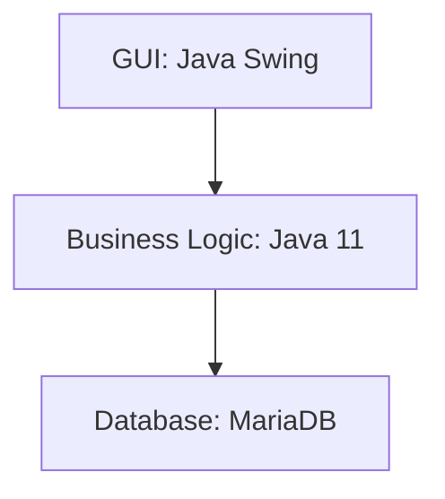

# Calculator

## Links
- https://www.atlassian.com/agile/kanban
- https://www.atlassian.com/agile/project-management/user-stories
- https://semver.org/
- https://www.jetbrains.com/help/idea/junit.html
- https://mermaid-js.github.io/mermaid-live-editor

## [MariaDb](https://hub.docker.com/_/mariadb/)
  - Start a mariadb server instance:
    ```
    docker pull mariadb
    docker network create some-network 
    docker run --detach -p 3306:3306 --network some-network --name some-mariadb --env MARIADB_USER=example-user --env MARIADB_PASSWORD=my_cool_secret --env MARIADB_ROOT_PASSWORD=my-secret-pw  mariadb:latest
    ```
  - Connect to MariaDB from the MySQL/MariaDB command line client
    ```
    docker run -it --rm --network some-network mariadb mysql -hsome-mariadb -uexample-user -p
    ```

## Design

